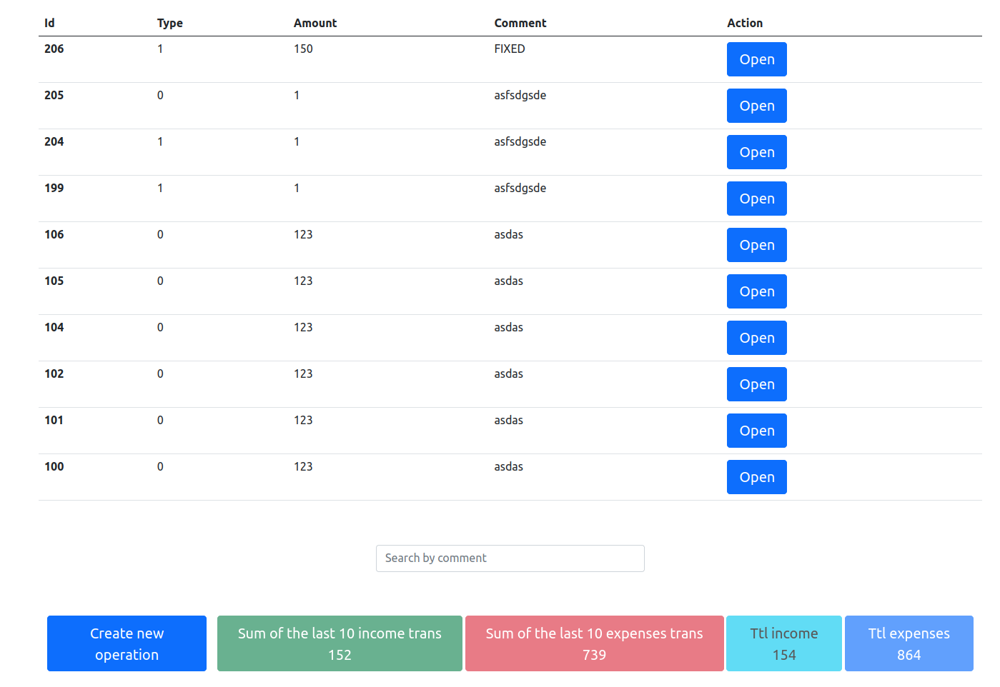
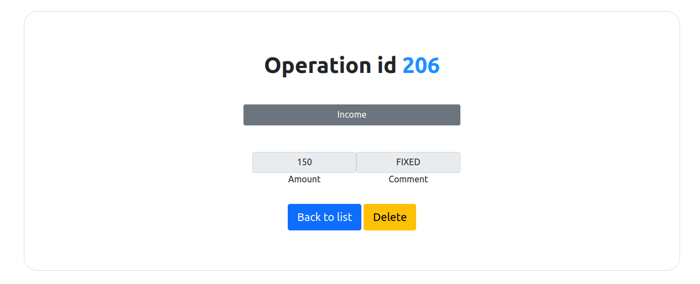

# Simple SPA
## Description

Specifics:
- Simple SPA page
- Front is written in JS, HTML, Boostrap 5
- Backend is run in Docker container (Nginx, PHP with no frameworks, MySQL)
- Operations list (income/expense) with last 10 entities
- Total sum of income and expenses
- Possibility to create new operation
- Possibility to view/delete specific operation
- Access to is restricted only for authorized users except for login and register
- Some basic security safeguards (SQL injections, etc)

Back-end:
- PHP 8.3 (no frameworks)
- MySQL 8
- Nginx
- Docker

Front-end:
- JavaScript
- HTML
- Boostrap 5
## Setup process
1. Create a folder we want to use for this project
2. Enter inside created folder using terminal
3. Clone the project into the folder with:

    `git clone git@github.com:AREZA13/spa-php-mysql.git .`
4. `chmod 777 logs/`
5. `docker compose up -d`
6. `docker exec -it spa-php-mysql-php-fpm-1 bash -c 'composer install'`
7. Visit http://localhost:37000/finance.html
8. Register a new user

When you end - don't forget to stop Docker containers with command:

`docker compose stop`

## Appearance

